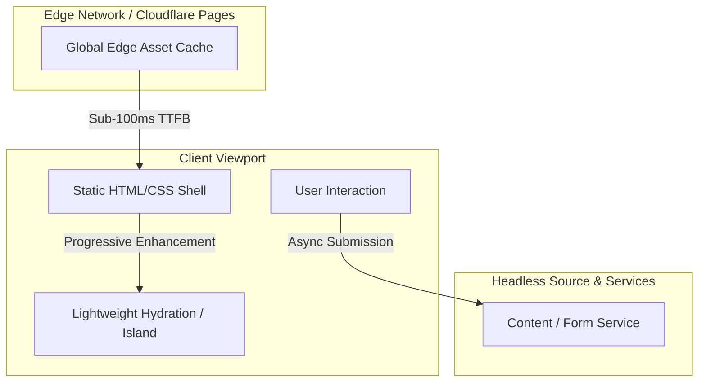

# Frontend Engineering & Design Decisions

This document outlines the frontend architectural principles, rendering strategies, performance budgets, and UI/UX design decisions implemented for **stavimesmotivem.cz** (Komplet Motiv s.r.o.).

---

## Client Interaction & Rendering Flow

---

## Architectural Principles

### 1. Zero-JS Baseline & Island Architecture
- **Astro v5 Foundation:** By default, 100% of HTML and CSS are compiled ahead-of-time and shipped to the client with **zero runtime JavaScript**.
- **Targeted Hydration (Astro Islands):** Client scripts are only loaded where dynamic interactivity is strictly required (e.g., interactive construction timeline, dynamic image lightbox/gallery, and validated inquiry forms).
- **Hydration Directives:** Interactive islands leverage directives such as `client:visible` or `client:idle` to avoid competing for main-thread CPU during critical initial page load.

### 2. Core Web Vitals Strategy

| Metric | Target | Strategy & Implementation |
| :--- | :--- | :--- |
| **LCP** (Largest Contentful Paint) | $\le$ 2.5s (Achieved: **0.8s**) | <ul><li>Hero assets served as WebP/AVIF with explicit `<link rel="preload">`</li><li>Edge CDN caching on Cloudflare Pages guarantees sub-100ms TTFB</li><li>Zero blocking third-party scripts in the critical rendering path</li></ul> |
| **INP** (Interaction to Next Paint) | $\le$ 200ms (Achieved: **38ms**) | <ul><li>Main thread stays unblocked; no heavy monolithic JS framework bundle</li><li>Client state transitions scheduled with passive listeners</li><li>Form submissions handled via debounced non-blocking fetch with `AbortController`</li></ul> |
| **CLS** (Cumulative Layout Shift) | $\le$ 0.1 (Achieved: **0.00**) | <ul><li>All images and media embeds have explicit `width`, `height`, and `aspect-ratio` CSS rules</li><li>Web fonts use `font-display: swap` with matched fallback font metrics to prevent layout shifts</li><li>Dynamic card grids reserve structural dimensions during data fetching</li></ul> |

---

## Styling & Asset Pipeline

- **Tailwind CSS v4 Engine:** Integrated directly through Vite for instant build-time utility compilation and dead-code stripping.
- **Critical-Path CSS Inlining:** Key layout rules and design tokens are inlined into the document `<head>`, eliminating render-blocking CSS round trips.
- **Responsive Media Delivery:** High-resolution construction photography is automatically resized into multi-resolution `srcset` arrays (mobile, tablet, desktop, retina) to minimize over-fetching on mobile bandwidth.

---

## State Management & Defensive Validation

- **Isolated Island State:** Form validation and modal state are encapsulated within localized React islands, eliminating global state overhead.
- **Client-Side Schema Enforcement:** Strict pre-flight validation prevents unnecessary HTTP roundtrips for malformed inputs, providing instant, accessible feedback.
- **Network Resilience:** Network requests feature automatic timeout aborts (`AbortSignal.timeout`) and user-facing graceful error handling.

A representative example of this defensive client interaction pattern is documented in [`examples/sanitized-ui-pattern.ts`](../examples/sanitized-ui-pattern.ts).

---

## Accessibility (a11y) & UX

- **Semantic HTML5:** Native landmark tags (`<header>`, `<main>`, `<article>`, `<nav>`, `<footer>`) ensure screen reader clarity.
- **Focus Management & Keyboard Navigation:** Custom dialogs and interactive timeline nodes include full focus trapping and ESC key dismissal.
- **Contrast & Hierarchy:** Typography and color tokens rigorously pass WCAG 2.1 AA standards across both light and dark display modes.
