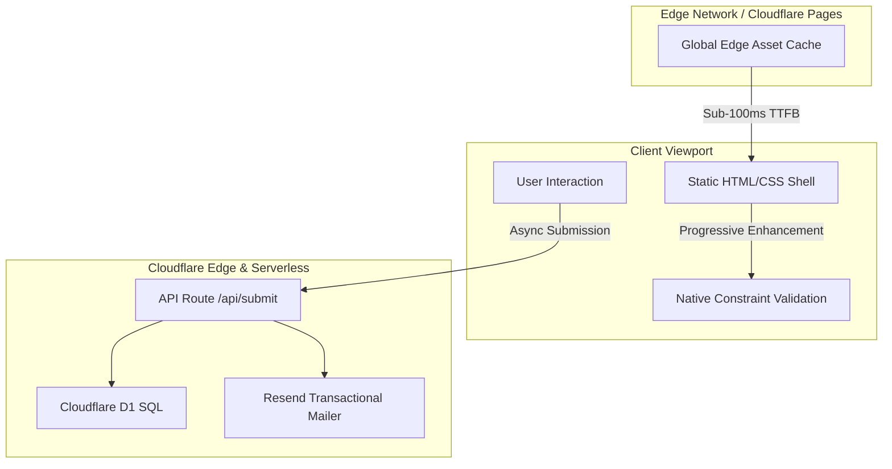

# Frontend Engineering & Design Decisions

This document outlines the frontend architectural principles, rendering strategies, performance budgets, and UI/UX design decisions implemented for **stavimesmotivem.cz** (Komplet Motiv s.r.o.).

---

## Client Interaction & Rendering Flow

---

## Architectural Principles

### 1. Zero-JS Framework Baseline
- **Pure Astro v5 Architecture:** 100% of static layout, marketing copy, and project showcases ship as pre-compiled HTML with **zero client-side framework runtime (no React / Vue on public pages)**.
- **Progressive Enhancement via Script Modules:** Client interactions (lead inquiry form, interactive timelines, image lightboxes) are implemented through lightweight TypeScript modules bundled into native ES script tags.
- **Main Thread Preservation:** Eliminating client hydration frameworks reduces JavaScript execution to under **15KB total**, leaving the browser main thread entirely free for instant scrolling and gestures.

### 2. Core Web Vitals Strategy

| Metric | Target | Strategy & Implementation |
| :--- | :--- | :--- |
| **LCP** (Largest Contentful Paint) | $\le$ 2.5s (Achieved: **0.8s**) | <ul><li>Hero assets formatted as WebP/AVIF with explicit preloading</li><li>Edge CDN caching on Cloudflare Pages guarantees sub-100ms TTFB worldwide</li><li>Zero blocking third-party scripts or bulky hydration runtimes</li></ul> |
| **INP** (Interaction to Next Paint) | $\le$ 200ms (Achieved: **38ms**) | <ul><li>Zero hydration lag: buttons and form inputs are immediately interactive on first paint</li><li>Form validation relies on native browser C++ constraint validation engines rather than heavy JS libraries</li><li>Asynchronous dispatch executes non-blockingly via fetch with AbortSignal timeouts</li></ul> |
| **CLS** (Cumulative Layout Shift) | $\le$ 0.1 (Achieved: **0.00**) | <ul><li>All construction photos and media slots have fixed `aspect-ratio` wrappers (e.g. `aspect-video` / `aspect-4/3`)</li><li>System font fallbacks matched to web fonts via size-adjust and `font-display: swap`</li><li>Dynamic timeline cards reserve structural heights during state changes</li></ul> |

---

## Authentic Component Architecture Showcases

Public sanitized implementations of the core UI components are available directly in the repository:

1. **Native Constraint Validation Form ([`components/SanitizedContactForm.astro`](../components/SanitizedContactForm.astro)):**
   - Utilizes pure CSS pseudo-classes (`:invalid`, `:placeholder-shown`) and the browser's native `checkValidity()` API.
   - Programmatically moves focus to the first `:invalid` input upon submission attempt to ensure strict accessibility (a11y).
   - Live asynchronous feedback with automatic state dismiss timers.

2. **Construction Progress Timeline ([`components/SanitizedTimeline.astro`](../components/SanitizedTimeline.astro)):**
   - Dynamic stage status calculation (`isCompleted`, `isCurrent`, upcoming phases).
   - Layout shift-free vertical progression with animated status indicators.

3. **Sanitized TypeScript Interaction Pattern ([`examples/sanitized-ui-pattern.ts`](../examples/sanitized-ui-pattern.ts)):**
   - Headless TypeScript module showcasing form serialization, validation checks, and resilient error recovery.

---

## Styling & Asset Pipeline

- **Tailwind CSS v4 Engine:** Integrated directly through Vite for instant build-time utility compilation and dead-code stripping.
- **Critical-Path CSS Inlining:** Key layout rules and design tokens are inlined into the document `<head>`, eliminating render-blocking CSS round trips.
- **Responsive Media Delivery:** High-resolution construction photography is automatically resized into multi-resolution `srcset` arrays (mobile, tablet, desktop) to prevent mobile bandwidth waste.

---

## Accessibility (a11y) & UX

- **Semantic HTML5:** Native landmark tags (`<header>`, `<main>`, `<article>`, `<nav>`, `<footer>`) ensure screen reader clarity.
- **Focus Management & Keyboard Navigation:** Form invalid traps, timeline milestones, and gallery dialogs include full keyboard accessibility.
- **Contrast & Hierarchy:** Typography and color tokens rigorously pass WCAG 2.1 AA standards.
