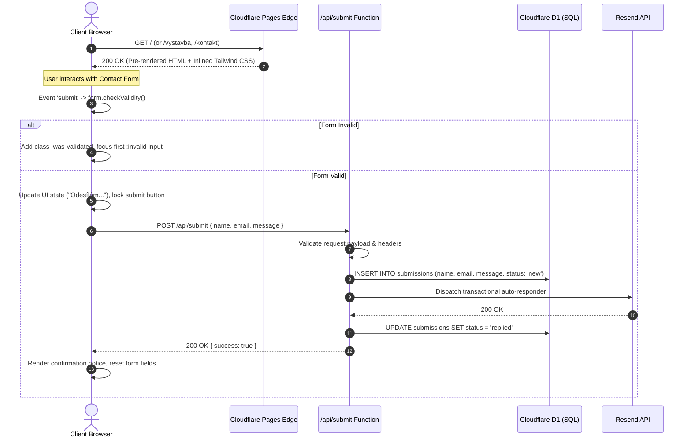

# Frontend Architecture & Engineering Decisions

This document outlines the frontend architectural principles, rendering strategies, performance budgets, and UI engineering decisions implemented for **stavimesmotivem.cz** (Komplet Motiv s.r.o.).

---

## Client Interaction & Serverless Workflow

---

## Architectural Principles

### 1. Zero-Framework Runtime Baseline
- **Pure Static Output:** Marketing pages and portfolio views are pre-compiled into static HTML at build time using Astro v5. No monolithic SPA framework runtime (such as React or Vue) is bundled or loaded on public-facing pages.
- **Native Script Modules:** Interactive components (e.g. contact form, gallery lightbox) use standalone vanilla TypeScript modules loaded via native browser script tags.
- **Main Thread Availability:** Because there is no client-side virtual DOM reconciliation or hydration pass, the browser main thread remains unblocked and ready for immediate user input upon first paint.

### 2. Core Web Vitals Performance Budget

Rather than relying on unverified synthetic scores, the frontend architecture enforces concrete constraints to satisfy Google Core Web Vitals thresholds:

| Metric | Target Budget | Architectural Enforcement Strategy |
| :--- | :--- | :--- |
| **LCP** (Largest Contentful Paint) | $\le$ 2.5s | <ul><li>Hero images served in modern WebP format with explicit preloading tags</li><li>Critical layout styles inlined into document `<head>` to eliminate render-blocking CSS requests</li><li>Edge caching on Cloudflare Pages ensures rapid HTML delivery worldwide</li></ul> |
| **INP** (Interaction to Next Paint) | $\le$ 200ms | <ul><li>Zero client-side hydration delays: form controls and links are interactive as soon as the DOM renders</li><li>Validation uses the browser's native C++ Constraint Validation API (`checkValidity()`) instead of heavy JavaScript parsing engines</li><li>Form submissions are dispatched asynchronously via `fetch` with `AbortController` timeouts</li></ul> |
| **CLS** (Cumulative Layout Shift) | $\le$ 0.1 | <ul><li>All construction photos and media slots have explicit CSS `aspect-ratio` wrappers to reserve layout space before images load</li><li>Web fonts use `font-display: swap` with matched system fallback metrics to prevent text layout reflow</li><li>Milestone cards use rigid CSS grid structures so dynamic status changes do not cause height shifts</li></ul> |

---

## Production Component Architecture Showcases

Sanitized versions of the core UI components are available directly in this repository:

1. **Native Constraint Validation Form ([`components/SanitizedContactForm.astro`](../components/SanitizedContactForm.astro)):**
   - Utilizes CSS pseudo-classes (`:invalid`, `:placeholder-shown`) and native HTML5 form validation.
   - Programmatically moves focus to the first invalid field upon submission for full accessibility (a11y).
   - Manages asynchronous submission states (loading, success, error) with auto-dismissing notifications.

2. **Construction Progress Timeline ([`components/SanitizedTimeline.astro`](../components/SanitizedTimeline.astro)):**
   - Renders project phases with dynamic status calculation (`isCompleted`, `isCurrent`, upcoming).
   - Layout-shift-free vertical progression with pulsing indicators for active milestones.

3. **Client Submission Module ([`examples/sanitized-ui-pattern.ts`](../examples/sanitized-ui-pattern.ts)):**
   - Independent TypeScript module demonstrating form data extraction, validation checks, and error handling.

---

## Asset Pipeline & Styling

- **Tailwind CSS v4 Integration:** Compiled directly via Vite at build time for precise dead-code elimination.
- **Critical CSS Inlining:** Stylesheets are bundled and inlined to avoid render-blocking network round trips.
- **Responsive Media Delivery:** Construction photography uses multi-resolution `sizes` and `srcset` attributes to serve appropriately sized assets to mobile viewports.

---

## Accessibility & Standards Compliance

- **Semantic HTML5:** Native landmark elements (`<header>`, `<main>`, `<article>`, `<nav>`, `<footer>`) ensure clear structure for screen readers.
- **Focus Management:** Invalid inputs receive automatic focus during validation attempts, allowing assistive technology users to identify and correct errors immediately.
- **Color Contrast:** Text and background color tokens meet WCAG 2.1 AA contrast requirements.
